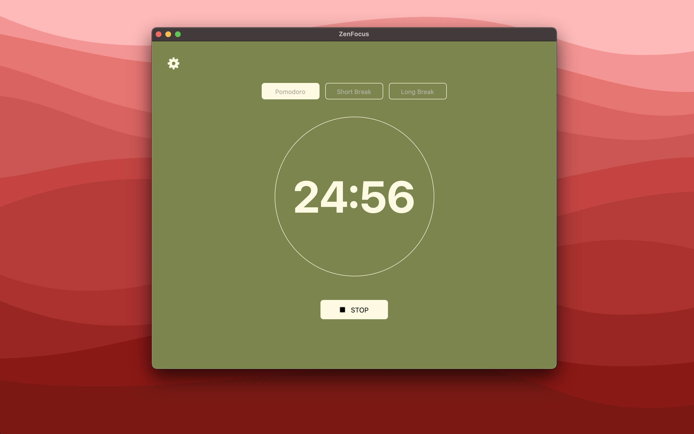
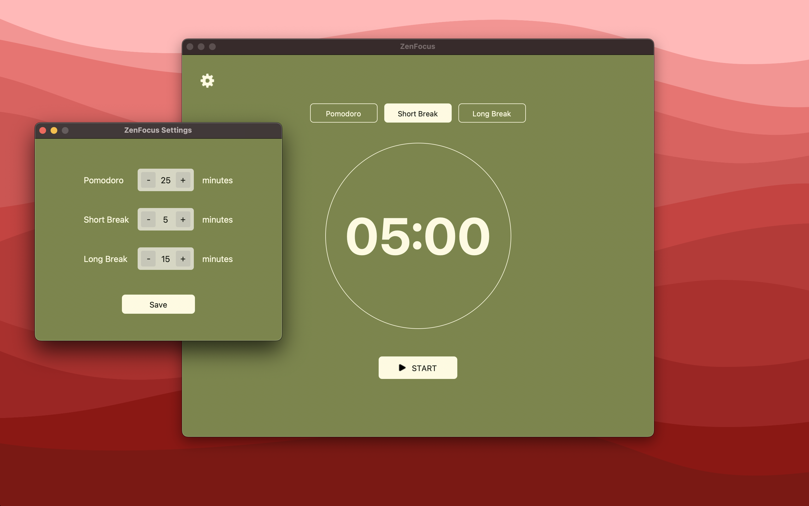

# tk-pomodoro-timer

A simple Pomodoro timer built with Python using Tkinter

### How to run

1. Python used:

   ```bash
   python --version
   Python 3.11.9
   ```

2. Install the packages:

   ```bash
   pip install -r requirements.txt
   ```

3. Execute the main Python script:
   ```bash
   python main.py
   ```

---

<h3 align="center">Home page</h3>
<p align="center">
  
</p>

<h3 align="center">Settings page</h3>
<p align="center">
  
</p>
